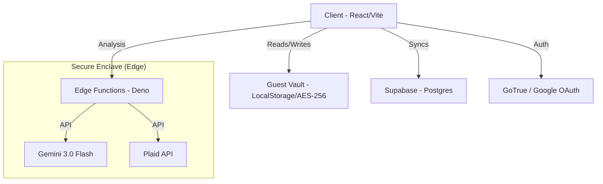
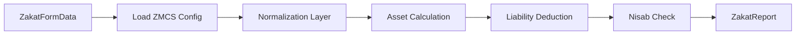

# ZakatFlow Engineering Design Document

| **Author** | ZakatFlow Engineering Team |
| :--- | :--- |
| **Status** | Living Document |
| **Last Updated** | February 15, 2026 (v0.28.0 — Security & Classification Overhaul) |
| **Audience** | Engineering, Product, Security, Open-Source Contributors |

## 1. Overview

### 1.1 Objective

ZakatFlow is an open-source, privacy-first Zakat calculation platform. It transforms Zakat calculation from a simple form-based calculator into a comprehensive, methodology-aware system supporting 8 scholarly methodologies via the **Zakat Methodology Configuration Standard (ZMCS)**.

### 1.2 High-Level Goals

- **Precision Compliance**: Calculate Zakat according to granular Fiqh rules using ZMCS configurations — not hardcoded logic
- **Privacy-First Architecture**: Zero-knowledge where possible; user financial data encrypted client-side for guests
- **Transparency & Traceability**: "Show your work" — every calculation is traceable to a specific ZMCS config field and scholarly ruling
- **Platform Agnostic**: Decoupled core engine to support future React Native implementation

---

## 2. Architecture

### 2.1 System Context

The system follows a **Hybrid Client-Server** model. Core calculation logic runs entirely client-side for privacy and speed. Persistence and third-party integrations leverage serverless Edge Functions.

### 2.2 Key Architectural Decisions

| Decision | Rationale |
| :--- | :--- |
| Client-side calculations | Financial data never leaves the device for computation |
| ZMCS config-driven engine | Eliminates hardcoded `if (hanafi)` branches; new methodologies added via JSON config |
| Zod schema validation | Runtime type-safety for all inputs (AI extraction, user forms, config loading) |
| Edge Functions for secrets | Plaid tokens, AI keys never touch the client |

---

## 3. Privacy & Security Design

> Full security policy: [SECURITY.md](SECURITY.md)

Data privacy is the paramount requirement for a financial application. ZakatFlow implements a **Two-Tier Encryption Architecture** with three trust zones.

### 3.1 Trust Zones

| Zone | Data Type | Storage | Encryption | Access |
| :--- | :--- | :--- | :--- | :--- |
| **Guest Vault** | Asset values, PII | `localStorage` | AES-256-GCM (Client-Side) | Device Only |
| **Cloud (User)** | Asset values, Zakat calculations, **Plaid account/holding metadata** | Postgres | TLS (Transit) + RLS + **Two-tier user-key encryption** (Managed Key or Sovereign zero-knowledge) | Authenticated User Only (client decrypts with user key) |
| **Secure Enclave** | Plaid access tokens only | Postgres | AES-256-GCM (Server-Side, per-user PBKDF2 key) | Edge Function Only |

### 3.2 Two-Tier Encryption (v0.28.0)

- **Managed Mode** (Default): User's symmetric key stored in database under RLS. Frictionless — no recovery phrase needed. We store the key but do not access decrypted data.
- **Sovereign Mode** (Opt-in): Key wrapped with a 12-word recovery phrase known only to the user. True zero-knowledge — server never sees the unencrypted key.
- **Both modes**: AES-256-GCM via `SubtleCrypto` (Web Crypto API). All saved calculations, Plaid account data, and metadata blobs are encrypted client-side before storage.

### 3.3 Guest Vault Encryption

- **Algorithm**: AES-256-GCM via `SubtleCrypto` (Web Crypto API)
- **Key Derivation**: Ephemeral session key in `sessionStorage` (memory-like)
- **Threat Model**: Protects against casual snooping; does not protect against a compromised device

### 3.4 Account Deletion (Cascade & Revoke)

1. Decrypt all stored Plaid tokens for the user
2. Revoke access via Plaid API (`/item/remove`)
3. Wipe all rows in `portfolios`, `asset_accounts`, `line_items`
4. Delete the auth user identity

---

## 4. The Zakat Calculation Engine

The heart of the application. Designed as a **deterministic, config-driven pipeline**.

### 4.1 ZMCS: Zakat Methodology Configuration Standard

The calculation engine is powered by ZMCS v2.0 — a JSON-based standard that encapsulates diverse juristic opinions into a structured configuration. Each methodology is a `ZakatMethodologyConfig` object validated against a Zod schema.

> Full specification: [ZMCS_SPECIFICATION.md](ZMCS_SPECIFICATION.md)

**Key properties of ZMCS:**
- **60+ configurable parameters** covering every calculation decision point
- **Rich documentation fields** (`description`, `scholarly_basis`) embedded in each section
- **8 shipped presets**: Hanafi, Shafi'i, Maliki, Hanbali, Bradford (Balanced), AMJA, Imam Tahir Anwar, Dr. Al-Qaradawi
- **Extensible**: Any scholar or institution can author a new preset

### 4.2 Pipeline Design

The engine follows a functional programming paradigm: `f(FormData, Config) → Report`.

1. **Config Loading**: Load and validate the selected ZMCS preset via `loadMethodologyConfig()`
2. **Normalization**: Ensure all fields exist; convert strings to numbers
3. **Asset Calculation** (`calculators/assets.ts`):
   - Applies per-class config rules (jewelry zakatability, passive investment treatment, retirement method)
   - Retirement logic supports 5 modes: `exempt`, `deferred_upon_access`, `conditional_age`, `full`, `net_accessible`
   - Roth IRA uses `roth_contributions_rate` and `roth_earnings_follow_traditional` from config
4. **Liability Deduction** (`calculators/liabilities.ts`):
   - Uses global `method` (`full_deduction`, `no_deduction`, `12_month_rule`, `current_due_only`)
   - Per-category rules for housing, student loans, credit cards, living expenses, insurance, unpaid bills, taxes
   - `calcRecurring()` and `calcLumpSum()` helpers apply the correct multiplier per category
5. **Nisab Check**: Compare net wealth against gold/silver threshold from config
6. **Output**: Structurally typed `ZakatReport` for rendering, PDF export, or CSV

### 4.3 Performance

- **Complexity**: O(N) where N = number of asset line items (typically < 100); effectively O(1) for the fixed-category aggregation
- **Latency**: Calculations complete in < 5ms
- **Deterministic**: Same inputs + same config = identical output

---

## 5. Data Flow & Integration

### 5.1 AI Document Parser

We use **Google Gemini 3.0 Flash** for document intelligence:

1. User uploads PDF/image
2. Frontend converts to Base64 (client-side resize)
3. `POST` to `parse-financial-document` Edge Function
4. Edge Function forwards to Gemini
5. **Sanitization**: AI output is strictly validated against a Zod schema before returning (prevents prompt injection)

### 5.2 Persistence (Sync Engine)

We use **TanStack Query** for data synchronization:

- **Optimistic Updates**: UI updates instantly; network request in background
- **Conflict Resolution**: Last-write-wins (LWW) — acceptable given single-user Zakat calculation context

### 5.3 Analytics (GA4)

ZakatFlow uses Google Analytics 4 with privacy-safe segmentation:

- **Measurement ID**: Configured via `VITE_GOOGLE_ANALYTICS_ID` environment variable
- **User Properties**: `madhab` (methodology), `simple_mode` (boolean), `wealth_tier` (privacy-safe bucket)
- **No PII**: Financial amounts are never sent to analytics

---

## 6. Testing Strategy

We employ a "Testing Trophy" strategy weighted toward Integration and Static Analysis.

| Layer | Tool | Focus |
| :--- | :--- | :--- |
| **Static** | TypeScript / ESLint | Type safety, strictly typed props |
| **Unit** | Vitest | Calculation engine: 168+ scenarios covering every Fiqh permutation |
| **Compliance** | Vitest (ZMCS suite) | Schema validation, metadata completeness, cross-methodology comparison |
| **Integration** | Vitest / Testing Library | Wizard flows, Plaid hook logic, document extraction mapping |
| **E2E** | Playwright | Smoke tests (Login → Calculate → Report) and accessibility |

### 6.1 ZMCS Compliance Tests

All 8 presets are validated against a comprehensive compliance suite (`zmcs_compliance.test.ts`):

- Schema validation (all presets pass Zod)
- Metadata completeness
- Jewelry rules per methodology
- Debt deduction behavior
- Retirement rules (Bradford exemption, Tahir Anwar full, AMJA net-accessible)
- Passive investment rates
- Cross-methodology comparison (ensures distinct Zakat amounts)

### 6.2 Accessibility Automation

Accessibility is a build-breaking requirement:

- **Suite**: `e2e/static-pages-a11y.spec.ts`
- **Mechanism**: Injects `axe-core` into every page during E2E runs
- **Gate**: CI fails if any WCAG 2.1 AA violation is found (contrast, labels, landmarks)

---

## 7. Design System (Material 3)

We implement a Token-Based Design System to ensure contrast compliance in all themes.

### 7.1 Core Principles

| Principle | Rule | Avoid |
| :--- | :--- | :--- |
| **Surfaces** | Use `bg-card`, `bg-muted` | `bg-gray-100`, `bg-white` |
| **Tints** | Use `bg-primary-container`, `bg-tertiary-container` | `bg-primary/10` (opacity hacks) |
| **Status** | Use `text-success`, `text-destructive`, `text-muted-foreground` | Direct Tailwind colors |
| **Data Viz** | Use `text-chart-1` through `text-chart-5` | Arbitrary color classes |

### 7.2 Container Tokens

We adopted Material 3's "Container" logic to solve the "Dark Mode Contrast" problem:

- **Token**: `--tertiary-container` (background) and `--on-tertiary-container` (text)
- **Implementation**: Defined in `index.css`
  - Light Mode: Light Yellow / Dark Yellow Text
  - Dark Mode: Dark Gold / Light Gold Text
- **Result**: Mathematically guaranteed contrast ratios in all themes

### 7.3 Typography

| Font | Usage |
| :--- | :--- |
| **Inter / Work Sans** | UI text (legibility) |
| **Lora** | Content/Hadith (solemnity) |
| **Inconsolata** | Numbers (tabular figures for alignment) |

### 7.4 Deliberate Exceptions

Dev/test pages (`DevTools.tsx`, `ExtractionTest.tsx`, `SankeyTest.tsx`) use hardcoded colors for debugging purposes. These are excluded from design system audits.

---

## 8. Stack Summary

| Layer | Technology | Rationale |
| :--- | :--- | :--- |
| **Frontend** | React 18 / Vite | Standard, rigorous ecosystem |
| **Language** | TypeScript 5 | Strict typing for financial calculations |
| **Styling** | Tailwind CSS / Shadcn UI | Token-based design system with Radix primitives |
| **Validation** | Zod | Runtime type safety for inputs, configs, and AI output |
| **State** | TanStack Query / React Context | Optimistic updates, cache management |
| **Charts** | Nivo (Sankey) / Recharts | Flow diagrams and data visualization |
| **PDF** | @react-pdf/renderer | Client-side PDF generation |
| **Testing** | Playwright + Vitest | Modern, fast, flake-resistant |
| **Backend** | Supabase (Postgres, Auth, Edge Functions) | Auth + DB + serverless in one platform |
| **AI** | Google Gemini 3.0 Flash | Superior context window for tabular data extraction |
| **Icons** | Phosphor Icons | Consistent, accessible icon set |
