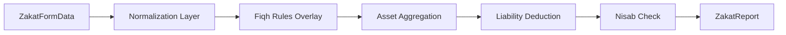

# ZakatFlow Engineering Design Document

| **Author** | ZakatFlow Engineering Team |
| :--- | :--- |
| **Status** | Living Document |
| **Last Updated** | Jan 19, 2026 (v0.17.0) |
| **Audience** | Engineering, Product, Security |

## 1. Overview

### 1.1 Objective
ZakatFlow aims to transform the Zakat calculation usage from a simple "form-based calculator" into a comprehensive **Asset-Centric Wealth Operating System**. This system must support granular asset tracking, complex theological rulings (Madhabs), historical persistence, and privacy-first architecture, enabling users to fulfill their religious obligation with precision and confidence.

### 1.2 High-Level Goals
*   **Precision Compliance**: Calculate Zakat according to granular Fiqh (jurisprudence) rules (Hanafi, Shafi'i, Maliki, Hanbali), not just generic totals.
*   **Privacy-First Architecture**: Zero-knowledge architecture where possible; specific user asset details should remain private or encrypted.
*   **Transparency & Traceability**: "Show your work" - every calculation must be traceable to a specific ruling or math operation.
*   **Platform Agnostic**: Decoupled core logic (Engine) to support future React Native implementation.

---

## 2. Architecture

### 2.1 System Context

The system follows a **Hybrid Client-Server** model. The core calculation logic is purely client-side for privacy and speed, while persistence and third-party integrations (Plaid, AI) leverage serverless Edge Functions.

```mermaid
graph TD
    Client[Client (React/Vite)] -->|Reads/Writes| GuestVault[Guest Vault (LocalStorage)]
    Client -->|Syncs| SupabaseDB[Supabase (Postgres)]
    Client -->|Auth| SupabaseAuth[GoTrue]
    
    subgraph "Secure Enclave (Edge)"
        Edge[Edge Functions (Deno)]
        Edge -->|API| Gemini[Gemini 3.0 Flash]
        Edge -->|API| Plaid[Plaid API]
    end

    Client -->|Analysis| Edge
```

---

## 3. Privacy & Security Design

Data privacy is the paramount requirement for a financial application. ZakatFlow implements a **Hybrid Encryption Strategy** depending on user state.

### 3.1 Trust Zones

| Zone | Data Type | Storage | Encryption | Access |
| :--- | :--- | :--- | :--- | :--- |
| **Guest Vault** | Asset Values, PII | `localStorage` | **AES-256-GCM** (Client-Side) | Device Only |
| **Cloud (User)** | Asset Values | Postgres | TLS (Transit) + RLS (At Rest) | Authenticated User Only |
| **Secure Enclave** | Plaid Tokens | Postgres | **AES-256-GCM** (Server-Side) | Edge Function Only |

### 3.2 Cryptographic Implementation

#### 3.2.1 Guest Vault (Client-Side)
To allow guests to use the app without data leaking to other users of the same device or XSS vectors reading cleartext easily:
*   **Algorithm**: `AES-256-GCM` via `SubtleCrypto` (Web Crypto API).
*   **Key Derivation**: Ephemeral session key generated on first visit, stored in `sessionStorage` (memory-like).
*   **Storage**: The payload in `localStorage` is the encrypted ciphertext.
*   **Threat Model**: Protects against casual snooping (someone borrowing the phone). Does not protect against compromised device (malware).

#### 3.2.2 Plaid Token Encryption (Server-Side)
Plaid `access_tokens` allow withdrawal of data and must be treated as critical secrets.
*   **Approach**: We do *not* store raw Plaid tokens in `asset_accounts`.
*   **Encryption**:
    *   **Key**: 32-byte hex secret (`PLAID_ENCRYPTION_KEY`) injected as an Environment Variable into the Edge Runtime.
    *   **Salt**: Unique 16-byte random salt generated *per token*.
    *   **Algorithm**: AES-256-GCM.
*   **Decryption**: Only occurs strictly within the `plaid-exchange-token` and `delete-account` Edge Functions. The database administrator cannot read these tokens without the runtime env var.

### 3.3 Account Deletion (Compliance)
The `delete-account` function performs a **Cascade & Revoke** operation:
1.  **Decrypt** all stored Plaid tokens for the user.
2.  **Revoke** access via Plaid API (`/item/remove`).
3.  **Wipe** all rows in `portfolios`, `asset_accounts`, `line_items`.
4.  **Delete** the auth user identity.

---

## 4. The Zakat Calculation Engine (`zakatCalculations.ts`)

The heart of the application. It is designed as a **deterministic, immutable pipeline**.

### 4.1 Pipeline Design

The engine follows a functional programming paradigm: `f(Input) -> Output`.



1.  **Normalization**: Ensure all fields exist. Convert strings to numbers.
2.  **Fiqh Overlay**: Apply the `MadhabRules` strategy.
    *   *Strategy Pattern*: Rather than spaghetti `if (hanafi)` checks, we look up a config object:
        ```typescript
        const rules = MADHAB_RULES[data.madhab];
        if (rules.jewelryZakatable) { ... }
        ```
3.  **Asset Aggregation**: Sums gross assets by class (Liquid, Metals, Retirement, etc.).
    *   *Retirement Logic*: Applies `zakatablePercent` (e.g., 30% for Bradford, 100% for others) at this stage.
4.  **Liability Deduction**:
    *   **The Waterfall Algorithm**: Deducts debts preferentially from "Cash" first, then "Investments", etc. This prevents "double counting" deductions against exempt assets.
    *   **Constraint**: `NetWealth` cannot be negative.
5.  **Output**: Returns a structurally typed `ZakatReport` ready for rendering or PDF generation.

### 4.2 Scalability
*   **Complexity**: O(1) effectively, as the number of asset categories is fixed (13). Even with granular line items (inputs), the aggregation step is O(N) where N is typically < 100 items. Calculations are strictly instant (< 5ms).

---

## 5. Data Flow & Integration

### 5.1 Intake: The AI Parser
We use **Gemini 3.0 Flash** for document intelligence.
*   **Flow**:
    1.  User uploads PDF/Image.
    2.  Frontend converts to Base64 (client-side resize).
    3.  `POST` to `parse-financial-document` Edge Function.
    4.  Edge Function forwards to verification model.
    5.  **Sanitization**: AI output is strictly validated against a Zod schema before returning to client (prevents prompt injection attacks returning garbage).

### 5.2 Persistence (Sync Engine)
We use `TanStack Query` for robust data synchronization.
*   **Optimistic Updates**: When a user adds an asset, the UI updates instantly. The network request happens in background.
*   **Conflict Resolution**: Last-write-wins (LWW) strategy. Given the single-user nature of Zakat (personal obligation), complex OT/CRDT is unnecessary.

---

## 6. Testing Strategy

We employ a "Testing Trophy" strategy, heavily weighted towards Integration and Static Analysis.

### 6.1 The Trophy

| Layer | Tool | Coverage Goal | Focus |
| :--- | :--- | :--- | :--- |
| **Static** | TypeScript / ESLint | 100% | Type safety, strictly typed props. |
| **Unit** | Vitest | 100% (Engine) | The `zakatCalculations.ts` file has **168+ comprehensive scenarios** covering every Fiqh permutation. |
| **Integration** | Vitest / Testing Library | Critical Paths | Wizard flows, Plaid hook logic, Document extraction mapping. |
| **E2E** | Playwright | Key Flows | Smoke tests (Login -> Calc -> Report). **Accessibility Compliance**. |

### 6.2 Accessibility Automation
We treat A11y as a build-breaking requirement.
*   **Suite**: `e2e/static-pages-a11y.spec.ts`.
*   **Mechanism**: Injects `axe-core` into every page during E2E runs.
*   **Gate**: CI fails if *any* WCAG 2.1 AA violation is found (contrast, labels, landmarks).

---

## 7. Design System (Material 3)

We implemented a rigorous Token-Based Design System to solve the "Dark Mode Contrast" problem permanently.

### 7.1 The Problem
Using opacity hacks (e.g., `bg-primary/10`) creates contrast failures in Dark Mode because the background color shifts constraints.

### 7.2 The Solution: Container Tokens
We adopted Material 3's "Container" logic.
*   **Token**: `--tertiary-container` (bg) and `--on-tertiary-container` (text).
*   **Implementation**: Defined in `index.css`.
    *   *Light Mode*: Light Yellow / Dark Yellow Text.
    *   *Dark Mode*: Dark Gold / Light Gold Text.
*   **Result**: 100% mathematically guaranteed contrast ratios in all themes, without manual tweaking per component.

### 7.3 Typography
*   **Inter / Work Sans**: UI text (Legibility).
*   **Lora**: Content/Hadith (Solemnity).
*   **Inconsolata**: Numbers (Tabular figures for alignment).

---

## 8. Stack Summary

| Layer | Technology | Rationale |
| :--- | :--- | :--- |
| **Frontend** | React 18 / Vite | Standard, rigorous ecosystem. |
| **Validation** | Zod | Runtime type safety for all inputs (AI, Forms). |
| **Charts** | Nivo (Sankey) | Best-in-class support for flow diagrams. |
| **Testing** | Playwright + Vitest | Modern, fast, flake-resistant. |
| **Backend** | Supabase | Postgres + Auth constraints solved out of the box. |
| **AI** | Gemini 3.0 Flash | Superior context window and speed for tabular data extraction. |
