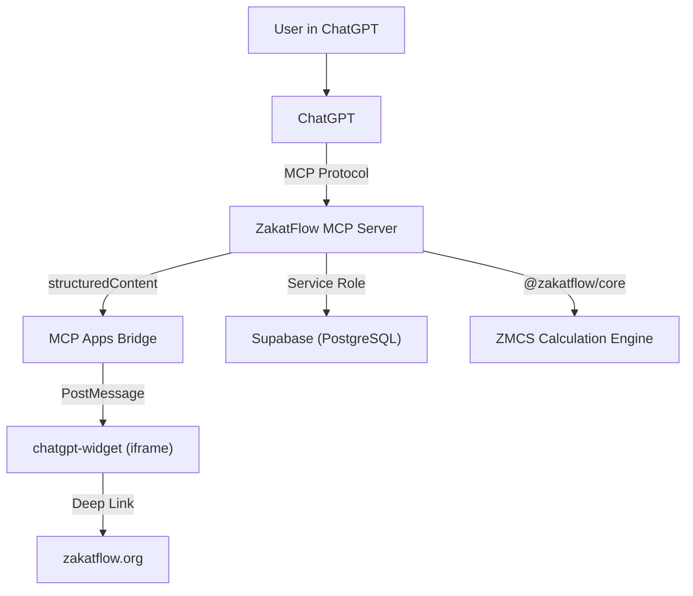
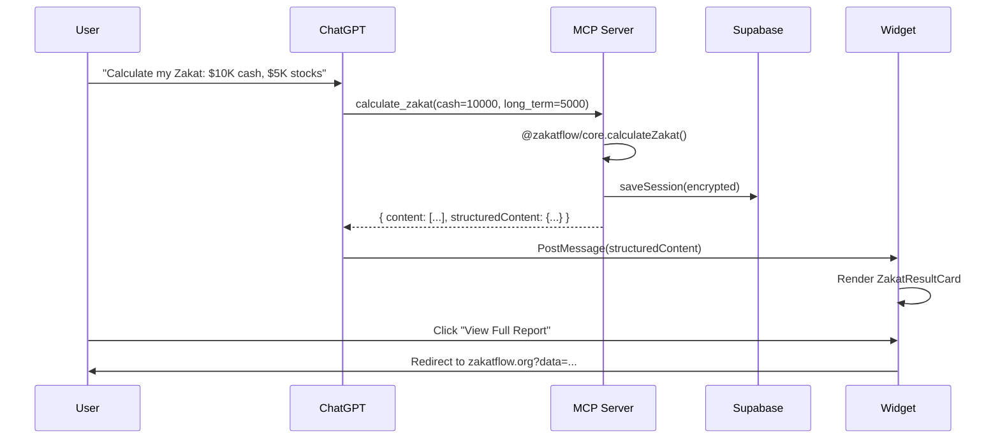

# Technical Design: ChatGPT Apps SDK Integration

> **Author:** Senior Tech Lead  
> **Status:** Implemented (PRs #30–#35 merged)  
> **Parent Issue:** [#24](https://github.com/naheed/zakah/issues/24)

---

## 1. Problem Statement

ZakatFlow's existing MCP server provides text-only tool responses to AI assistants. Users asking ChatGPT to calculate their Zakat receive a wall of plain text — no visual breakdown, no methodology comparison, no persistent sessions. This limits engagement and makes it difficult to convey the nuance of different scholarly approaches.

### Goals

1. Render interactive UI widgets inside ChatGPT conversations
2. Persist user identity and session data across conversations
3. Encrypt sensitive financial data at rest
4. Maintain backward compatibility with existing text-mode MCP clients

---

## 2. Architecture

### System Context



### Package Boundaries

| Package | Responsibility | Dependencies |
|---------|---------------|--------------|
| `packages/core` | ZMCS calculation engine, 8 methodology presets | Zero runtime deps |
| `apps/mcp-server` | MCP tools, identity, encryption, session store | `@zakatflow/core`, `@modelcontextprotocol/sdk`, `@supabase/supabase-js` |
| `apps/chatgpt-widget` | React widget cards rendered in ChatGPT | `@modelcontextprotocol/ext-apps/react`, `@openai/apps-sdk-ui` |
| `apps/web` | Main web application (unmodified by this work) | — |

### Data Flow



---

## 3. Key Design Decisions

### 3.1 Dual Supabase Client Pattern

**Decision:** Two separate Supabase clients with different permission levels.

| Client | Key Type | Use Case | Risk Profile |
|--------|----------|----------|-------------|
| `getSupabase()` | Anon (publishable) | Public data reads | Low — RLS enforced |
| `getSupabaseAdmin()` | Service Role | ChatGPT identity writes | High — bypasses RLS |

**Rationale:** The MCP server is a trusted backend process, not a browser. Using the service role key for ChatGPT-specific tables avoids needing to implement Supabase Auth for a non-browser context. RLS still protects the anon key from accessing ChatGPT tables (zero public policies).

### 3.2 Envelope Encryption (Privacy Vault)

**Decision:** Server-side AES-256-GCM with scrypt key derivation.

```
ENCRYPTION_MASTER_KEY (env var, 256 bits)
    → scrypt(master_key, random_salt) → DEK
        → AES-256-GCM(DEK, random_IV, plaintext) → ciphertext

Envelope: [salt:16][iv:12][authTag:16][ciphertext:N]
Serialized: "enc:v1:" + base64(envelope)
```

**Key properties:**
- Unique salt + IV per encryption (never reused)
- scrypt parameters: N=16384, r=8, p=1 (OWASP recommended)
- GCM authentication tag prevents tampering
- Plaintext fallback when `ENCRYPTION_MASTER_KEY` is unset
- Plain JSON is automatically detected and deserialized on decrypt

**Alternative considered:** Using the web app's `jose` JWE library. Rejected because the MCP server runs in Node.js where `crypto.createCipheriv` is native and avoids the `jose` dependency.

### 3.3 Isolated Widget Package

**Decision:** Separate `apps/chatgpt-widget` package instead of adding to `apps/web`.

**Rationale:**
- `apps/web` uses Tailwind CSS 3 (via `@shadcn/ui`); the widget needs Tailwind 4 for `@openai/apps-sdk-ui` compatibility
- Widget must build to a single self-contained HTML file for MCP resource embedding
- Different deployment target (served by MCP server, not Vercel/Lovable)
- Independent test suite (jsdom environment, not Playwright)

### 3.4 MCP Apps Bridge API

**Decision:** Use `onAppCreated` callback with `app.ontoolresult` event handler.

```tsx
const { app } = useApp({
    appInfo: { name: 'ZakatFlow', version: '0.2.0' },
    capabilities: {},
    onAppCreated: (app) => {
        app.ontoolresult = (result) => {
            // Route structuredContent to the correct widget
        };
    },
});
```

**Routing logic:** Data shape discrimination, not tool name matching:
- `data.zakatDue` (number) → `ZakatResultCard`
- `data.type === 'comparison'` → `MethodologyComparisonCard`
- `data.type === 'session_progress'` → `SessionProgressCard`

This decouples the widget from specific tool names and makes it forward-compatible with new tools.

---

## 4. Database Schema

### Tables (service-role access only)

```sql
CREATE TABLE chatgpt_users (
    id UUID PRIMARY KEY DEFAULT gen_random_uuid(),
    chatgpt_user_id TEXT UNIQUE NOT NULL,
    display_name TEXT,
    preferred_madhab TEXT DEFAULT 'bradford',
    created_at TIMESTAMPTZ DEFAULT now(),
    updated_at TIMESTAMPTZ DEFAULT now()
);

CREATE TABLE chatgpt_sessions (
    id UUID PRIMARY KEY DEFAULT gen_random_uuid(),
    user_id UUID REFERENCES chatgpt_users(id) ON DELETE CASCADE,
    session_data JSONB,          -- Encrypted envelope or plain JSON
    methodology TEXT DEFAULT 'bradford',
    created_at TIMESTAMPTZ DEFAULT now(),
    updated_at TIMESTAMPTZ DEFAULT now()
);

-- RLS: enabled, zero public policies
ALTER TABLE chatgpt_users ENABLE ROW LEVEL SECURITY;
ALTER TABLE chatgpt_sessions ENABLE ROW LEVEL SECURITY;
```

### Indexes

- `chatgpt_users.chatgpt_user_id` — UNIQUE, fast lookup by OpenAI user ID
- `chatgpt_sessions.user_id` — FK, cascade delete

---

## 5. Security Model

### Threat Boundaries

| Threat | Mitigation |
|--------|-----------|
| Master key exposure | Environment variable only — never in code or version control |
| Session data at rest | AES-256-GCM encryption before Supabase write |
| Anon key accessing ChatGPT data | RLS with zero public policies on `chatgpt_*` tables |
| Prompt injection via tool inputs | Zod schema validation on all tool parameters |
| Ciphertext tampering | GCM authentication tag (128-bit) detects modification |
| Key reuse | Unique random salt (128-bit) + IV (96-bit) per encryption |

### Graceful Degradation

| Missing Config | Behavior |
|---------------|----------|
| No `SUPABASE_URL` | Server runs without persistence — in-memory sessions only |
| No `SUPABASE_SERVICE_KEY` | Admin client returns null — identity features disabled |
| No `ENCRYPTION_MASTER_KEY` | Session data stored as plaintext JSON (logged warning) |
| No `CLIENT_URL` | Deep-links default to `https://zakatflow.org` |

---

## 6. Testing Strategy

### Scoped Testing (per `/orchestrate` workflow rules)

| Package | Command | Tests | Duration |
|---------|---------|-------|----------|
| `apps/mcp-server` | `npm test --workspace=apps/mcp-server` | 49 | ~1.1s |
| `apps/chatgpt-widget` | `npm test --workspace=apps/chatgpt-widget` | 21 | ~1.0s |
| **Total** | — | **70** | **~2.1s** |

### Test Categories

| Category | What's Tested |
|----------|--------------|
| Tool correctness | `calculate_zakat` structuredContent shape, calculation accuracy across 8 madhabs |
| Comparison logic | `compare_madhabs` multi-methodology output, key rule assertions |
| Widget contract | URI protocol, MIME type, component exports |
| Crypto round-trip | Encrypt → decrypt, tamper detection, wrong key rejection, large payloads |
| Identity graceful fallback | All identity functions return null/empty when Supabase is unconfigured |
| Type contracts | Widget TypeScript interfaces match MCP server structuredContent shapes |

---

## 7. Future Work (Phase 3)

| Item | Description |
|------|-------------|
| Dockerfile | Multi-stage build: `npm ci` → `npm run build` → Node.js slim runtime |
| Cloud Run | Serverless deployment with `ENCRYPTION_MASTER_KEY` in Secret Manager |
| App Store submission | OpenAI App Store listing with widget preview screenshots |
| `start_session` / `add_asset` tools | Interactive multi-turn MCP tools that emit `session_progress` structuredContent |
| Widget hot-reload | Vite HMR proxy for local widget development inside ChatGPT |

---

## 8. References

- [MCP Apps SDK Documentation](https://modelcontextprotocol.io/apps)
- [OpenAI Apps SDK UI](https://www.npmjs.com/package/@openai/apps-sdk-ui)
- [ext-apps React Hooks API](https://www.npmjs.com/package/@modelcontextprotocol/ext-apps)
- [ZakatFlow ZMCS Engine](../packages/core/README.md)
- [Privacy Vault Pattern](../apps/web/src/lib/sessionEncryption.ts)
