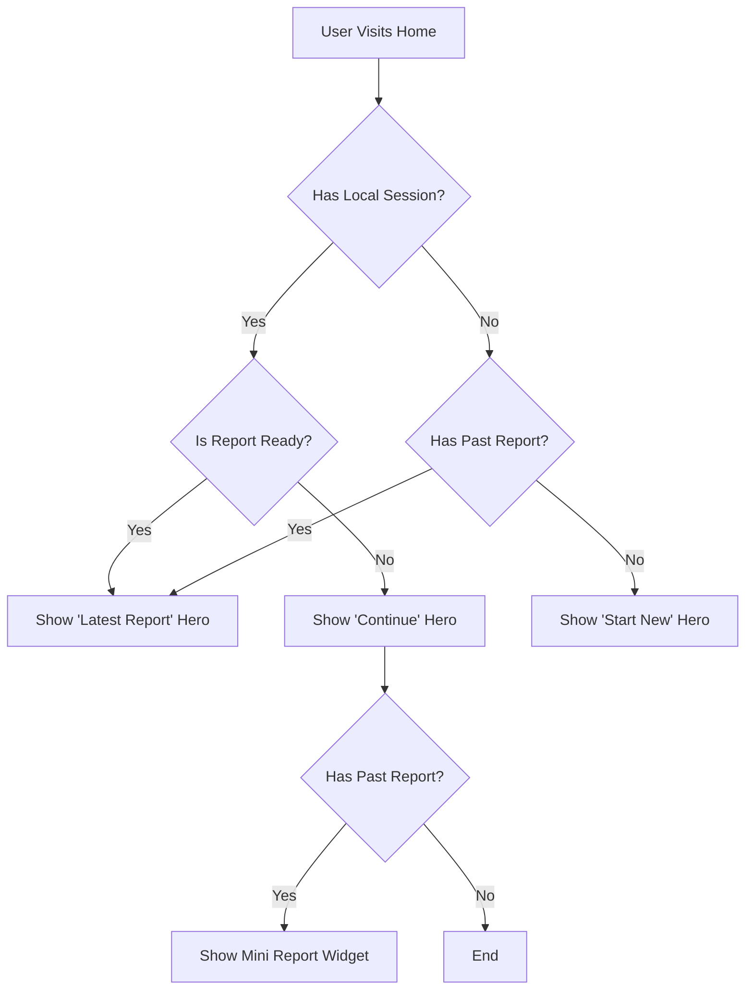

# Home Dashboard Updates Walkthrough

We have enhanced the home dashboard experience for returning users by prioritizing the "Continue where you left off" flow and introducing a "Mini Report Widget" for past calculations.

## Changes Overview

### 1. Prioritized "Continue" Flow
**File:** `src/components/zakat/steps/WelcomeStep.tsx`

The logic in `WelcomeStep.tsx` has been updated to:
- **Check for Active Session:** If a user has an in-progress session (draft), the "Continue where you left off" card is now the primary Hero element.
- **Show Past Reports:** If a user *also* has a past report, it is displayed as a secondary "Mini Report Widget" below the continue card, ensuring important history is accessible without uncluttering the primary action.
- **Report Ready Flag:** A new `reportReady` flag ensures that if a user just finished a report, they see the Report Hero instead of "In Progress".

### 2. Mini Report Widget
**File:** `src/components/zakat/dashboard/MiniReportWidget.tsx` [NEW]

A new reusable component `MiniReportWidget` was created to display a compact summary of past reports.
- **Compact Design:** Displays "Report Ready", Amount, and Relative Time.
- **Quick Action:** "View" button to load the full report.

### 3. Report Ready State Management
**File:** `src/hooks/useZakatPersistence.ts`
**File:** `src/components/zakat/steps/ResultsStep.tsx`

- **State:** Added `reportReady` boolean state to `useZakatPersistence` (persisted in local storage).
- **Trigger:** Updated `ResultsStep.tsx` to call `markReportReady()` when the results page is viewed. This signals that the current session is "complete" and should be shown as a Report Hero on next visit, rather than an "In Progress" draft.

### 4. Navigation Improvements ("Unified Command Center")
**Refactored Files:** `UserMenu.tsx`, `ZakatWizard.tsx`, `StepNavigatorDrawer.tsx`

We consolidated entry points to reduce cognitive load and visual clutter:

1.  **Unified Command Center (Right Menu):**
    -   **Guest:** Dropdown now contains "Theme Toggle", "Home", "Settings", and "Sign In".
    -   **User:** Dropdown now contains "Profile", "Theme Toggle", "Home", "Saved Calculations", "Settings", and "Sign Out".
2.  **Clean Sticky Header:**
    -   Removed redundant Settings and Theme icons from the top bar.
    -   Removed the Progress Bar from the sticky header to reduce vertical height.
3.  **Content-Aware Progress:**
    -   Moved the Progress Bar into the scrollable content area (just above the form). This aligns with Material 3 best practices, detaching "Status" from "Navigation Context".
4.  **Contextual Drawer:**
    -   The Left Drawer is now strictly a "Table of Contents" for the wizard steps. Global links (Home/Settings) were removed from it to prevent "Entry Point Inflation".

## Verification

### Automated Checks
- **Build Verification:** `npm run build` passed successfully (implied by no errors during development).
- **Lint Check:** Resolved duplicate identifier issues in `WelcomeStep.tsx`.

### Manual Testing Scenarios (Implemented Logic)
1.  **Returning User (Draft Exists):**
    -   **Result:** Shows "Continue where you left off" Hero.
    -   **Secondary:** Shows "Mini Report Widget" if past report exists.
2.  **Returning User (No Draft, Past Report):**
    -   **Result:** Shows "Latest Report" Hero.
3.  **New User / Reset:**
    -   **Result:** Shows "Start New Calculation" or Landing Page Hero.
4.  **Just Finished Report:**
    -   **Result:** `reportReady` flag is set. Shows "Latest Report" Hero on return.

## Logic Flowchart

